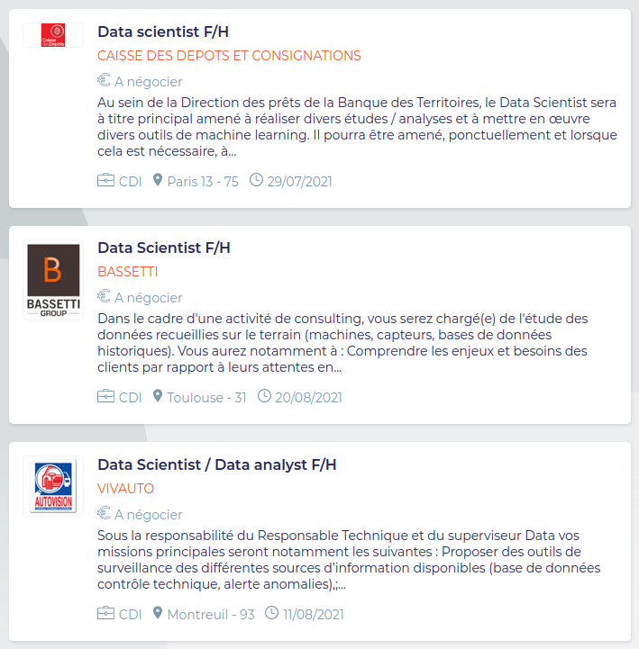

```{r, echo=FALSE}
library(metathis)
meta() %>% 
  meta_description(params$event) %>% 
  meta_name("github-repo" = paste0("datactivist/", params$slug)) %>% 
  meta_viewport() %>% 
  meta_social(
    title = params$title,
    url = paste0("https://datactivist.coop/", params$slug),
    image = params$image,
    image_alt = params$image_alt,
    og_type = "website",
    og_author = "Datactivist",
    og_locale = "fr_FR",
    og_site_name = "Datactivist",
    twitter_card_type = "summary",
    twitter_creator = "@datactivi_st")

```

layout: true

<style>
.remark-slide-number {
  position: inherit;
}

.remark-slide-number .progress-bar-container {
  position: absolute;
  bottom: 0;
  height: 4px;
  display: block;
  left: 0;
  right: 0;
}

.remark-slide-number .progress-bar {
  height: 100%;
  background-color: #e95459;
}


.yellow-h{
   background: #ffff88;
}

.blue-h{
   background: #83c7fc;
}

.white-bg{
   background: #ffffff;
}


.caption {
  text-align: right;
  font-size: .8rem;
}

.redred {
  color: #ff0000;
}

.green {
  color: #00ff00;
}

.orange {
  color: #ffa500;

}

.quote {
  font-family: 'Rokkitt';
  font-weight: bold;
  font-style: italic;
  font-size: 28px;
}


.pull-left-wide {
  width: 65%;
  float: left;
}

.pull-right-wide {
  width: 65%;
  float: right;
}

.pull-right-narrow {
  width: 30%;
  float: right;
}

.pull-left-narrow {
  width: 30%;
  float: left;
}


</style>


`r paste0("<div class='my-footer'><span>", params$event, "</span> <center><div class=logo><a href='https://datactivist.coop/'></a></div></center></span></div>")` 


---

class: center, middle

This presentation is available at : `r paste0("http://datactivist.coop/", params$slug, "/", params$session, "/", params$module)`

Sources : `r paste0("https://github.com/datactivist/", params$slug, "/", params$session, "/", params$module)`


All Datactivist productions are freely usable under the terms of [Creative Commons 4.0 BY-SA](https://creativecommons.org/licenses/by-sa/4.0/legalcode.fr) licence.

<BR>
<BR>


---

background-image: url(https://media.giphy.com/media/lQCZNoImQVZvRWChuS/giphy.gif?cid=ecf05e47prx5gdrdg73edt8ggf3qilq1z3q9nynt5t1gqjeu&rid=giphy.gif&ct=g)
class: inverse, center, top

### WARNING !<br>this presentation will feature many GIFs and western pop culture references

---

class: center, top

## After this bootcamp, you may want to escape data science

--

.center[

]

## for good ...

---

background-image: url(https://media.giphy.com/media/13ROLRgvNf5WQo/giphy.gif?cid=ecf05e4784jizw5cdsfi7b38uapop892fbhcsza9sh3y3iq6&rid=giphy.gif&ct=g)
class: center, top


## ... unfortunately for you, it will be hard to avoid it

---

background-image: url(https://media.giphy.com/media/xT9C25UNTwfZuk85WP/giphy-downsized-large.gif?cid=ecf05e471uzc5tuw52n0dslae0e6hksd2e0cqmqzm7jjcker&rid=giphy-downsized-large.gif&ct=g)
class: center, top

## Whatever path you choose,<br>you'll find data on your way

---

background-image: url(https://media.giphy.com/media/LWFeKOW41NHOIbDNXu/giphy.gif?cid=ecf05e47fq7k9m142959q1yulwbb6qa0bbukf3kwzzr7jw8u&rid=giphy.gif&ct=g)
class: center, top

### The best way to deal with it :

## embrace its power !

---

class: center, middle, inverse

# 7 reasons to keep using data science

---

background-image: url(https://media.giphy.com/media/dIBLtolI6axTGIGopo/giphy.gif?cid=790b7611cc38e7cdfe931af73749559f1f6e6cd8b59cd51e&rid=giphy.gif&ct=g)
class: center, top

### 1. You are socially made of data

However disconnected you are.

---

background-image: url(https://media.giphy.com/media/AWv3UAFkgz39u/giphy.gif?cid=ecf05e47lln96kt74e7etz7fnrzrs8b9bdlgkb4rcvp9ksso&rid=giphy.gif&ct=g)
class: center, top, inverse

### Pop quizz : prove this wrong !

---

background-image: url(https://media.giphy.com/media/DOdsiolqbxCbm/giphy.gif?cid=ecf05e471axfmaphooznqumn23y7rqtg6yt9swrn0gwd99ig&rid=giphy.gif&ct=g)
class: center, top

### 2. Data isn't "in the news",<br>it often IS the news

---

.pull-left-narrow[Revelations about databases, the handling of data by government or private companies, evolution of regulation ... data is not only a material for newsrooms, it became a topic by itself.

Mainly personal data, but not only.

On the right : [The Intercept, August, 18 2021](https://theintercept.com/2021/08/17/afghanistan-taliban-military-biometrics/).]

.pull-right-wide[

]

---

background-image: url(https://media.giphy.com/media/Xtg9ygGsjvouF7vZ1w/giphy.gif?cid=790b7611ac9f762b6c94e77710e55979f7927fa9045f2fc0&rid=giphy.gif&ct=g)
class: center, top, inverse

### Also, it can help you decypher<br>booby-trapped buzz words

---

background-image: url(https://media.giphy.com/media/rcOlpTCkM1GAE/giphy.gif?cid=ecf05e473nrow275hto7jt02jkwjimn3jdkeamm9h1vd9nvl&rid=giphy.gif&ct=g)
class: center, top

### 3. Data related issues impact all policies

---

.center[

Who thought a server's choice could have such a terrible consequence ?

Source : [The Guardian, October 6, 2020](https://www.theguardian.com/politics/2020/oct/05/how-excel-may-have-caused-loss-of-16000-covid-tests-in-england).
]

---

background-image: url(https://media.giphy.com/media/3o7aTFnG95Q8VIsRqw/giphy.gif?cid=790b7611f91fef2b70c6bf2b331ea08e16fae98311e7099e&rid=giphy.gif&ct=g)
class: center, top

### 4. Data science is a new language

--

.footnote[I told you Matthieu I would mention classic American musicals in the class !]

---

.pull-left-wide[
.center[

]
]

.pull-left-narrow[Wherever you'll get a job, it's pretty likely you end up talking to a data scientist.

Better be prepared.

Take a look at the companies and organizations recruiting data scientists, you may be surprised !

Source : [Apec.fr, on August 24th 2021](https://www.apec.fr/candidat/recherche-emploi.html/emploi?motsCles=data%20scientist&page=1).]

---

background-image: url(https://media.giphy.com/media/4onH6IzqTeS2iqWh77/giphy.gif?cid=ecf05e47bj9l0kuyof695rt8annquyj8l5aoclq2j0vs4txi&rid=giphy.gif&ct=g)
class: center, top

### 5. "Code is law"

---

background-image: url(https://media.giphy.com/media/5dYeglPmPC5lL7xYhs/giphy.gif?cid=ecf05e47wmxzc23ktqkqsyq8ja8vgvlovdg9fjal6dw8983e&rid=giphy.gif&ct=g)
class: center, top

### 6. Data-driven decisions are among us

Like, for real.

---

background-image: url(https://media.giphy.com/media/2nt2dX21yO0NAaP7BS/giphy.gif?cid=ecf05e47o03pz67ajidpwh5m1hcxzlzrdtz4e155vhkr889w&rid=giphy.gif&ct=g)
class: center, top

### 7. Data is a place of power

On all sides.

---

.pull-left[
### Google's GTFS

Never heard of it ? Well, it practically rules public transportation sector.

]

.pull-right[
### Statactivism


]

---
class: inverse, center, middle

# Questions ?

Contact : [mathieu@datactivist.coop](mailto:mathieu@datactivist.coop) & [sylvain@datactivist.coop](mailto:sylvain@datactivist.coop)