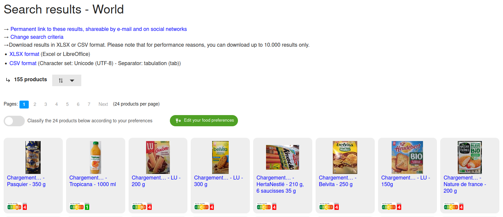
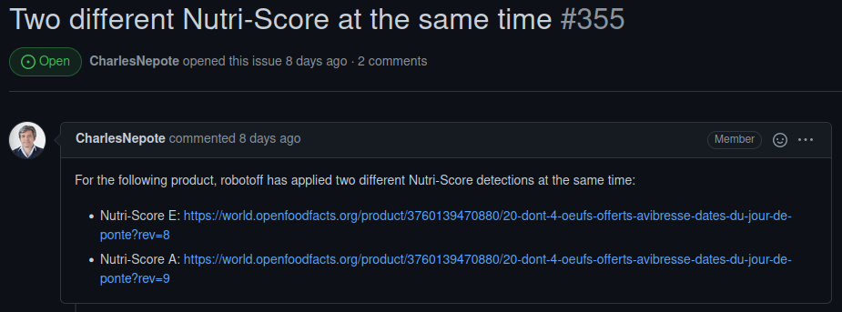
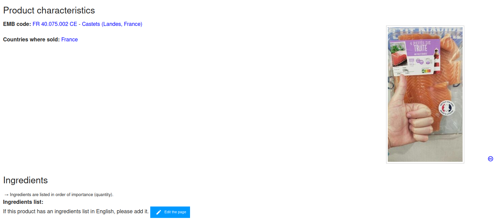

```{r, echo=FALSE}
library(metathis)
meta() %>% 
  meta_description(params$event) %>% 
  meta_name("github-repo" = paste0("datactivist/", params$slug)) %>% 
  meta_viewport() %>% 
  meta_social(
    title = params$title,
    url = paste0("https://datactivist.coop/", params$slug),
    image = params$image,
    image_alt = params$image_alt,
    og_type = "website",
    og_author = "Datactivist",
    og_locale = "fr_FR",
    og_site_name = "Datactivist",
    twitter_card_type = "summary",
    twitter_creator = "@datactivi_st")

```

layout: true

<style>
.remark-slide-number {
  position: inherit;
}

.remark-slide-number .progress-bar-container {
  position: absolute;
  bottom: 0;
  height: 4px;
  display: block;
  left: 0;
  right: 0;
}

.remark-slide-number .progress-bar {
  height: 100%;
  background-color: #e95459;
}

.yellow-h{
   background: #ffff88;
}

.blue-h{
   background: #83c7fc;
}

.white-bg{
   background: #ffffff;
}


.caption {
  text-align: right;
  font-size: .8rem;
}

.redred {
  color: #ff0000;
}

.green {
  color: #00ff00;
}

.orange {
  color: #ffa500;

}

.quote {
  font-family: 'Rokkitt';
  font-weight: bold;
  font-style: italic;
  font-size: 28px;
}


.pull-left-wide {
  width: 65%;
  float: left;
}

.pull-right-wide {
  width: 65%;
  float: right;
}

.pull-right-narrow {
  width: 30%;
  float: right;
}

.pull-left-narrow {
  width: 30%;
  float: left;
}


</style>


`r paste0("<div class='my-footer'><span>", params$event, "</span> <center><div class=logo><a href='https://datactivist.coop/'></a></div></center></span></div>")` 


---

class: center, middle

This presentation is available at : `r paste0("http://datactivist.coop/", params$slug, "/", params$session, "/", params$module)`

Sources : `r paste0("https://github.com/datactivist/", params$slug, "/", params$session, "/", params$module)`


All Datactivist productions are freely usable under the terms of [Creative Commons 4.0 BY-SA](https://creativecommons.org/licenses/by-sa/4.0/legalcode.fr) licence.

<BR>
<BR>


---

class: center, top

background-image: url(https://upload.wikimedia.org/wikipedia/commons/7/75/Open_Food_Facts_logo.svg)


# How do you make a citizen-led food database ?

---

class: inverse, center, top


## Easy, just crowdsource</br>the data !

--

.center[


### But what does it mean exactly ?]

---

class: inverse, center, top

background-image: url(https://media.giphy.com/media/uWzDsAsRm2X9qULHLs/giphy.gif?cid=ecf05e47fhenkcrdy6acg90xjgsh82xc3s744kehn24gh0vv&rid=giphy.gif&ct=g)

## 1. Defining input format

---

### "What you see is what you get"

First difficulty : as a citizen-led project, Open Food Facts should be accessible to anyone willing to contribute. Hence, the required data must be easy to find. As easy as **back-of-pack** food labelling is.

Off Food Facts maps its categories on the food labelling :


---

### No prior knowledge

.pull-left[To stay as accessible as possible, OFF sticks to the labels : no transformation or interpretation of the data is required.

The database wiki offers guidance on the way to fill the data fields : how to name packaging shapes ? How to spell product's name ?

But, most of the time, the advices goes :

> The best way to fill it is to enter the value as indicated on the product. Don't forget the units!
]

.pull-right[Data fields as listed in [the OFF Wiki](https://wiki.openfoodfacts.org/Data_fields) :


]

---

### A food data conondrum : labels

One specific issue with food products is the endless variety of labels and mentions they can be tagged with.

Apart from their basic meaning, the scope is too wide to sort in an ordered fashion : from agricultural method used to diet compatibility or ecological impact, the diversity of themes is multiplied by the languages and countries they are distributed in.

OFF's choice on this matter is, yet again, based on accessibility : one open field to gather labels and a ridiculously long list of the known ones to structure a taxonomy ([16606 labels in different languages to date](https://github.com/openfoodfacts/openfoodfacts-server/blob/main/taxonomies/labels.txt)).


---

### Automated data fields

.pull-left[#### Metadata

Every entry in the database should be documented by itself : to follow the evolution of the database, it must contain the information on who modified what and when.

Those data are called **metadata** as they document the data itself. Those entries are always automated and can't be modified manually as they ensure the integrity of the database (and the tracability of the modification, as we'll see in part 3).
]

.pull-right[#### Calculated fields

Some data *can* be automated based on input data from the community and most of the time *is* (as it can be missing frmo the package) :


]

---


class: center, top

background-image: url(https://media.giphy.com/media/jn7ma87aWgWXiI9D0N/giphy.gif?cid=ecf05e47a5lfonw95oa7254m297vmo8t54r66c5e9ichapa7&rid=giphy.gif&ct=g)

### Bulk and fresh :</br>OFF's dead angle

.footnote[As OFF focuses on packaged product, bulk and fresh food products and beverages are absent from the database.]

---

class: inverse, center, top

background-image: url(https://media.giphy.com/media/pxByU4o4jZu3XrOxct/giphy.gif?cid=ecf05e47d3l1toydqhkr977ae2bdj4ft7z1112r98gtr7jl5&rid=giphy.gif&ct=g)


## 2. Gathering contributions

---

### The OFF technologie(s)

Open Food Facts is made of [several layers of software](https://wiki.openfoodfacts.org/Software_Development) dedicated to each part of the project :

* **the database** itself (Perl and MongoDB) ;
* the website (HTML5, JS, Foundation)
* the various phone apps (Swift, Java) ;
* the data processing features (machine learning, annotation, etc.) ;
* the software developpment kits for external reuse ;
* etc.

All of which is open source, freely available and open to contribution [on Github](https://github.com/openfoodfacts).

The tool used to allow contribution is similar to MediaWiki, widely known as the *"Wikipedia interface"*.

---

class: inverse, center, top

background-image: url(https://media.giphy.com/media/20zfQZZc54UNje9qQw/giphy.gif?cid=790b76119179b92f50d6b8ffa9c23840537361588e3c9101&rid=giphy.gif&ct=g)

### But you all have already contributed to Wikipedia, right ?

---

class: inverse, center, top

background-image: url(https://media.giphy.com/media/xUOxeRVBTkYT2yOC5y/giphy.gif?cid=790b7611dcc23b1a1bfe22b1720d0a8ee97469752648cc6f&rid=giphy.gif&ct=g)

### ... right ?

---

### How to start editing a product

At the top-right corner of each product page, a **Edit the page** button allows anyone to access the editing interface :


---

#### Editing a product page

.pull-left[
.center[

]
]

.pull-right[Once you identified yourself with an OFF account, you access the **editing interface** consisting in the list of the data fields with each variable open to editing :

* **free field variables** you can complete with simple text ;
* **drop down menues** when possible values are limited (such as units) ;
* **upload fields** to add pictures of the product and its label.

Each field can be documented in a specific language.

Examples are given to help contribution.
]

---

### OFF's API

.pull-left[
Contributing through the web interface can be a hastle (especially when walking down supermarket isles).

The OFF projects allowed other apps to contribute to the project in their own interface by making available an application programming interface, or **API**. This programs works as an intermediate between the OFF database and external apps.

In practice, the API is a two-way-door :

* as an **entry point** it can receive data from the outside ;
* as an **exit point** it can make data available from the inside.
]

.pull-right[The best know app for contributing via your phone, we already mentionned, is Yuka.

But there's [a wide array of reuses through the OFF API](https://wiki.openfoodfacts.org/Reuses_of_Open_Food_Facts) :

* [fraise ou bacon](https://www.fraiseoubacon.com/) : an app taking your dietary preferences and food urges into account to give Nutri-Score rated recipes ;
* [c'est meballé près de chez vous](https://cestemballepresdechezvous.fr/) : to find locally packaged products ;
* [Allergobox](https://www.allergobox.com/) : to help you find food products compatible with you allergies ;
* etc.


]

---

### Brands contributions

Since 2020, food manufacturers can also contribute by sharing data on their products manually through a Pro interface or [automatically via the platform of the company Equadis](https://fr.blog.openfoodfacts.org/news/des-donnees-produits-sur-open-food-facts-en-direct-des-fabricants-et-en-temps-reel-avec-equadis).

OFF promotes this features with 3 main arguments :

1. the visibility of the data ;
2. the automation of nutrition score calculation ;
3. the possibility to improve the products based on the platform's data.

.pull-left-narrow[The Italian pasta manufacturer [Barilla edited this way 236 products from his various brands](https://world.openfoodfacts.org/editor/barilla) (including industrial bread Harrys).
]

.pull-right-wide[
.center[

]
]

---

class: inverse, center, top

background-image: url(https://media.giphy.com/media/CmFMWpEa4IFtS/giphy.gif?cid=790b7611a25b3bc07900688e1b7f80b5fd297693eea77d89&rid=giphy.gif&ct=g)

## 3. Controlling data quality

---

.quote[As with all computer stuff, following what's going on boiles down to knowing three things:
</br></br>.center[.red[who] did .red[what] and .red[when] ?]]

In *computer person language* (or, *"technical English"*), the documents compiling those informations are called **"logs"**.

And, following the Wikipedia's example, OFF's logs are entirely public : you can access them by clicking **Edit** on a product's page and scroll down.

--

For example, here are the last modification to [the all wheat crustless sliced bread from Harrys](https://world.openfoodfacts.org/cgi/product.pl?type=edit&code=3228857000166) :


---


class: inverse, center, top

background-image: url(https://media.giphy.com/media/KHfidaIqN0Sqc/giphy.gif?cid=ecf05e47rb3vt9446mtch88zkol9hrhu4mts311lrfogwr6m&rid=giphy.gif&ct=g)

## Quick trivia !!!!!

--

### Why do we feature the device people modified the database with ?

---


class: inverse, center, top

background-image: url(https://media.giphy.com/media/kfvlYOjwdzd8nkRjku/giphy.gif?cid=ecf05e4795j1kul47dvreaaz8st4w71vl90cp3u0bl298xcq&rid=giphy.gif&ct=g)

## ... and the answer is ...

---

### ... because it helps pointing OS version specific bugs !

For example : in an old Android bug, the name of the product was systematically replaced with *"Loading ..."*. Most of the phones were patched ... but some still have this issue.

--

As you can see [here](https://world.openfoodfacts.org/cgi/search.pl?action=process&search_terms=chargement%E2%80%A6&sort_by=unique_scans_n&page_size=24&page=1&sort_by=unique_scans_n) :

.center[

]

---

### Contributions method means verification method

By opening up its database to contribution by anyone, OFF exposes it to several issues with data consistency. We'll focus on 3 of those :

1. **variability in channel of contribution** : mainly a technical issue as we saw earlier, it can partly be automated but requires human scrutiny ;
2. **quality of input data** : for one, nutrition information is a hard topic to dig in, and its term can be confusing at times. Then, OFF uses its own taxonomy and standards to make things coherent and it's easy to deviate when you're a rookie ;
3. **completion of the product pages** : OFF contributions can be partial and often are. Editors can just fix a quantity or add a label ... leaving entire sections of the product page empty. Hence, data completion can vary greatly from one product to another, making comparison harder if possible.

---

### Data quality : human scrutiny

Most of the work of looking at data quality is performed via human observation and manual correction. As a collaborative database, OFF verification is fueled by the same energy as the contribution : the will to help out making it better.

[Quality](https://wiki.openfoodfacts.org/Quality) page in the OFF Wiki lists some of the most frequent issues encountered.

--

** What kind of issue do you think are the most common and looked after ?**

---

### Data quality : AI at the rescue !

OFF harnesses the potential of [artificial intelligence](https://wiki.openfoodfacts.org/Artificial_Intelligence) to automate tedious tasks (in short : making computer job).

It works on two main tools :

1. [robotoff](https://github.com/openfoodfacts/robotoff) : the OFF AI service, per say, calling machine learning models to make prediction about sections of product pages and suggesting corrections for common flaws (abusive pictures, spellchecking, bad labelling, etc.) ;
2. [Hunger Games](https://hunger.openfoodfacts.org/) is the robotoff's annotation system. In practice, it provides an interface for human to assess the relevance of robotoff's suggestions.


---

#### robotoff's issues

Because AI always needs human scrutiny [not to mess things up itself](https://github.com/openfoodfacts/robotoff/issues/355) !

.center[

]


---

### Data quality : verifications

.pull-left[

]

.pull-right[Another project was launched to oversee a specific part of human scrutiny : [verifications](https://wiki.openfoodfacts.org/Verification).

Aside from the way fields are filled by users, verification intends to create a taxonomy to *"label"* issues regarding the way data are inputed :

* doubtful accounts (bots, massive edits ...) ;
* data consistency (additives for organic products, presence of pork in products claimed *"halal"*) ;
* [noteworthy products](https://wiki.openfoodfacts.org/Verification/Noteworthy_Products) (strange ingredients, same barcodes, etc.).]

---

### Data completion : state labels

.pull-left-wide[
OFF software also has features to organise human scrutiny.

To follow on the level of completion of the product page and facilitate the contribution, OFF taxonomy added a specific type of label to product pages : [the state labels](https://wiki.openfoodfacts.org/State).

By tagging the level of completion of each part of a product page or specific issues, OFF makes it possible to technically sort together pages needing the same kind of human intervention.

#### What kind of issues do you expect to appear in the list of the state labels ?
]

--

.pull-right-narrow[

]
---

### Data completion : nudges

Example : [trout](https://world.openfoodfacts.org/product/4334035448558/paves-de-truite) !



--

.footnote[You may have guessed the photo also needs to be validated.]

---
class: inverse, center, middle

# Questions ?

Contact : [mathieu@datactivist.coop](mailto:mathieu@datactivist.coop) & [sylvain@datactivist.coop](mailto:sylvain@datactivist.coop)
