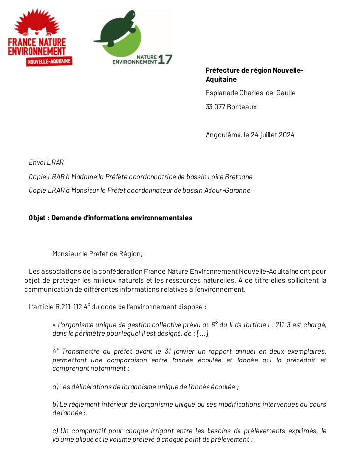
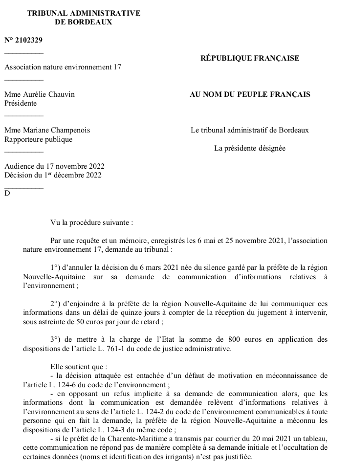
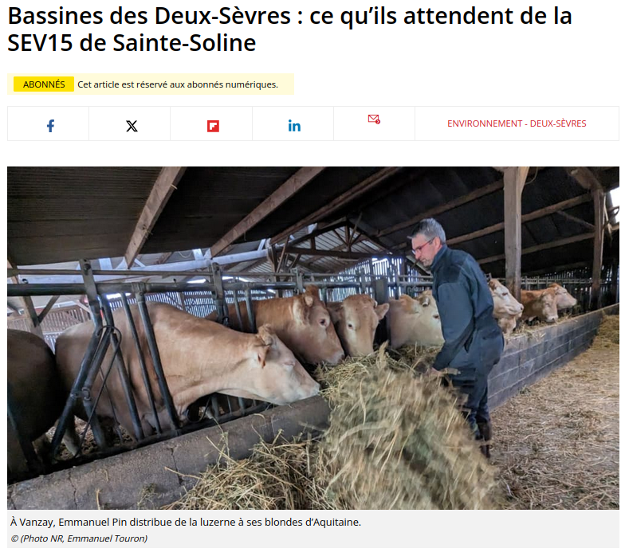
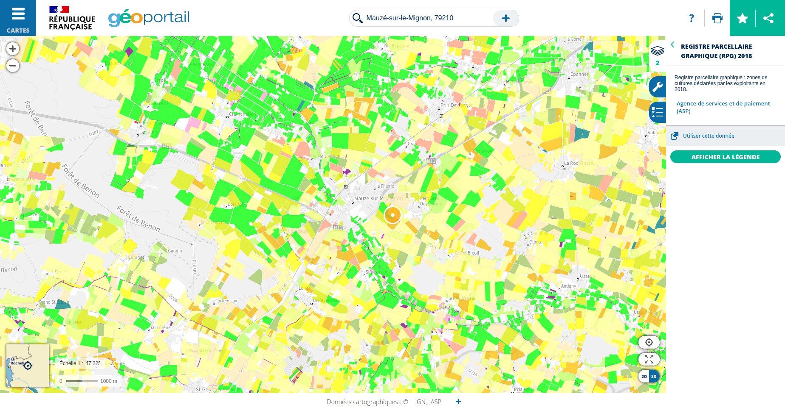
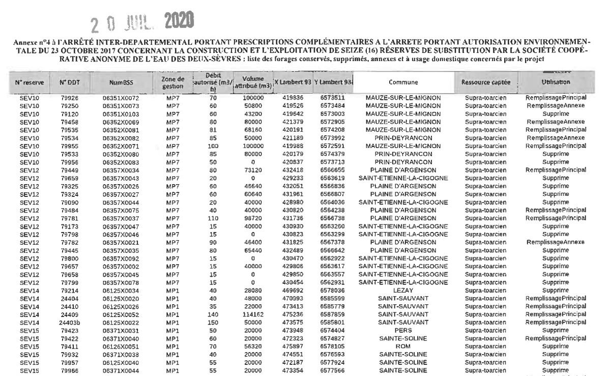
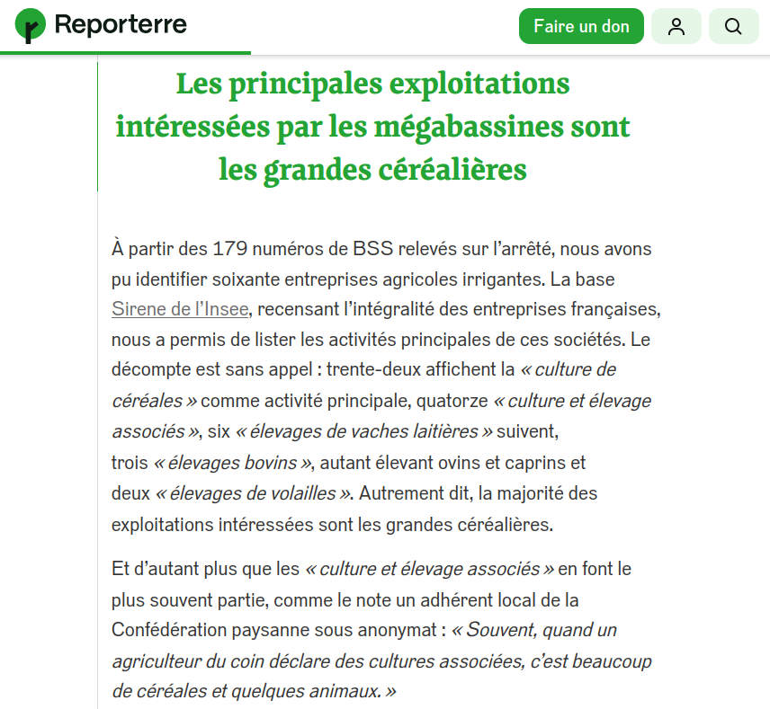
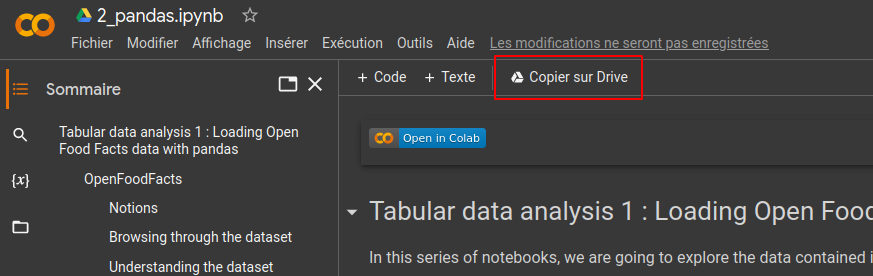

layout: true

`r paste0("
", params$event, "
")` 

---

class: center, middle

This presentation is available at : `r paste0("https://moreymat.github.io/", params$slug, "/presentations/", params$session)`

Sources : `r paste0("https://github.com/moreymat/", params$slug, "/presentations/", params$session)`

Those productions are freely usable under the terms of [Creative Commons 4.0 BY-SA](https://creativecommons.org/licenses/by-sa/4.0/legalcode.fr) licence.

 
 

---

# Disclaimer : our moto

> There are no silly questions.

--

> There are only awkward silences.

---

background-image: url(https://media.giphy.com/media/d1E1kn94NNfrlPGw/source.gif)
class: inverse, center, top

# What is this class ?

---

### The objectives

* understanding what Python is ;
* understanding what a notebook is and learning how to use it ;
* understanding what data science is ;
* learning how to perform basic data exploration ;
* learning how to answer questions with a dataset.

---

### The teachers

.pull-left[
.center[**Mathieu Morey**]

.center[]

Machine learning engineer @Corcentric, previously researcher ; consultant / data analyst / data scientist

Based in Marseille ⚽

Works on invoice extraction, machine learning and natural language processing.

]

.pull-right[
.center[**Sylvain Lapoix**]

.center[]

Datajournalist and trainer, former consultant / data analyst

Based in La Rochelle 🏉

Works for digital and print media on ecological, agricultural and social topics.

]

---

background-image: url(https://i.giphy.com/media/v1.Y2lkPTc5MGI3NjExeHRkMmY4YWpkd3dwNW02Y3BtcDhoOXdsbWJteWZ3MmVja3Q1aTg0biZlcD12MV9pbnRlcm5hbF9naWZfYnlfaWQmY3Q9Zw/l3q2LNVExEP0z9CrS/giphy.gif)
class: inverse, center, top

# Introducing ourselves (in data)

---

## Let's get to know each other (with variables)

Each of you is expected to introduce one's self using the same five items :

.pull-left[

1. first name ;
2. study field of the last diploma ;
3. country of origin ;
4. height in cm.

Please respect the units...
]

--

.pull-right[

**.red[No exceptions allowed !]**

]

---

## And so, here is a database

---

## No prerequisite for this class !

---

### If you get stuck ... please proceed as followed

.pull-left[
1. Read the notebook and read your code ;
2. Look the documentation up (you'll have plenty) ;
3. Ask your buddy ;
4. Ask a teacher as a last resort.
]

.pull-right[

]

--

But, who is my buddy ?

---

## So let's use ouf database !

We're going to randomly assign you one buddy to work with during this workshop :

* they'll be your backup in case of difficulty ;
* you're going to be a team for the project work assigned tomorrow afternoon.

---

background-image: url(https://i.giphy.com/media/v1.Y2lkPTc5MGI3NjExZjZqbmpoeTVpbm4xanpkODR5M3F1OHVmbzY1dXR5cTZpMDM2dGxsMyZlcD12MV9pbnRlcm5hbF9naWZfYnlfaWQmY3Q9Zw/xT9C25UNTwfZuk85WP/giphy.gif)
class: inverse, center, top

# Coding in the real : why producing data ?

---

## Have you heard of the "mégabassines" ?

---

## The project of the surface tanks

.pull-left[
The logic :

* the cooperative pumps water in surface tanks during high-water season (Winter) ;
* redistributes it during dry / crop irrigation season (Summer) ;
* hence lowering pumping in water stocks during Summer.

**Outcome** : less water drawn from the environment.
]

--

.pull-right[
The underlying data :

* flow rate in surface waters and stock in groundwater tables ;
* water volumes pumped into the tank systems ;
* water volumes distributed from the surface tanks ;
* water volumes drawn from the water sheds.

]

---

background-image: url(https://i.giphy.com/media/v1.Y2lkPTc5MGI3NjExbnV5dDNsaGFjZWtucjBpcDB5OXI0cG9keng5MzV1NG95bnNhOWU5cSZlcD12MV9pbnRlcm5hbF9naWZfYnlfaWQmY3Q9Zw/GbH8vRmrNHdVZhouBt/giphy.gif)
class: inverse, center, top

### That's the theory ...

---

### In practice : environmental NGOs brought the case to court

.pull-left[

]

.pull-right[

]

---

## Underlying question : water, what for ?

.center[

]

Source : [La Nouvelle République, 20220203](https://www.lanouvellerepublique.fr/deux-sevres/environnement/reserves-d-eau/deux-sevres-la-bassine-de-mauze-sur-le-mignon-sera-entierement-remplie-fin-mars#!).

---

### Public position

.center[

]

Source : [La Nouvelle République, 20230310](https://www.lanouvellerepublique.fr/deux-sevres/commune/sainte-soline/bassines-des-deux-sevres-ce-qu-ils-attendent-de-la-sev15-de-sainte-soline#!).

---

### A true mess

.center[

]

---

### Investigating to figure out the data

.center[

]

---

### Producing the missing data

Source : [Reporterre, 20240117](https://reporterre.net/Profits-export-et-grandes-cultures-les-vraies-raisons-des-megabassines).

.center[

]

---

background-image: url(https://media.giphy.com/media/JrYnKirK79252t3wDs/giphy.gif)
class: inverse, center, top

# Let's dive into it !

---

### Our program

.pull-left[

**Day 1**

- 14:00 - introduction
- 15:15 - break 1 (15' tops)
- 17:20 - group correction and quiz day 2

**Day 2**

- 10:00 - presentation ;
- 10:30 - back to work ;
- 11:15 - break 1 (15' tops)
- 13:00 - **lunch break** - 60 min
- 14:00 - presentation
- 15:25 - break 2 (15' tops)
- 16:35 - break 3 (15' tops)
- 17:20 - group correction and quiz day 2

]

.pull-right[

**Day 3**

- 09:00 - guest presentation ;
- 10:00 - back to work ;
- 11:15 - break 1 (15' tops)
- 12:40 - group correction - 20 min
- 13:00 - **lunch break** - 60 min
- 15:20 - group correction and quiz day 3

**Day 4**

- 09:00 - project rules recap ;
- 09:15 - project work ;
- 11:15 - break 1 (15' tops)
- 11:00 - project's presentations ;
- 12:15 - final quizz and debrief ;
- 13:00 - bye bye !

]

---

.pull-right[
**The Github repo will be your house for this bootcamp**. Link : https://github.com/moreymat/scpo-data-science-bootcamp

1- Follow the link of the Google Colab notebook

2- Save a copy of the notebook in your own Google Drive storage

---

background-image: url(https://i.giphy.com/media/v1.Y2lkPTc5MGI3NjExcjFva3h6enZ0cTNjMmI2cjJ5c3VneWlwcTlveDZ6Nndoc2lsMGIyNSZlcD12MV9pbnRlcm5hbF9naWZfYnlfaWQmY3Q9Zw/scZPhLqaVOM1qG4lT9/giphy.gif)
class: inverse, center, top

# Now let's code

---

class: inverse, center, middle

# Questions ?

Contact : [mathieu.morey@gmail.com](mailto:mathieu.morey@gmail.com) & [sylvainlapoix@protonmail.com](mailto:sylvainlapoix@protonmail.com)