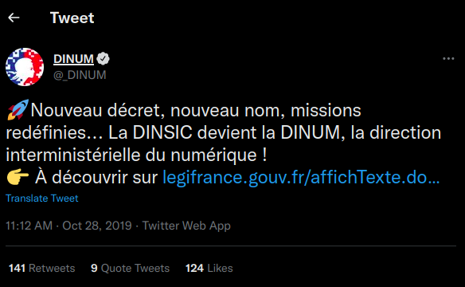

```{r, echo=FALSE}
library(metathis)
meta() %>% 
  meta_description(params$event) %>% 
  meta_name("github-repo" = paste0("datactivist/", params$slug)) %>% 
  meta_viewport() %>% 
  meta_social(
    title = params$title,
    url = paste0("https://datactivist.coop/", params$slug),
    image = params$image,
    image_alt = params$image_alt,
    og_type = "website",
    og_author = "Datactivist",
    og_locale = "fr_FR",
    og_site_name = "Datactivist",
    twitter_card_type = "summary",
    twitter_creator = "@datactivi_st")

```

layout: true

<style>
.remark-slide-number {
  position: inherit;
}

.remark-slide-number .progress-bar-container {
  position: absolute;
  bottom: 0;
  height: 4px;
  display: block;
  left: 0;
  right: 0;
}

.remark-slide-number .progress-bar {
  height: 100%;
  background-color: #e95459;
}

</style>


`r paste0("<div class='my-footer'><span>", params$event, "</span> <center><div class=logo><a href='https://datactivist.coop/'></a></div></center></span></div>")` 


---

class: center, middle

This presentation is available at : `r paste0("http://datactivist.coop/", params$slug, "/presentations/", params$session, "/", params$module)`

Sources : `r paste0("https://github.com/datactivist/", params$slug, "/presentations/", params$session, "/", params$module)`


All Datactivist productions are freely usable under the terms of [Creative Commons 4.0 BY-SA](https://creativecommons.org/licenses/by-sa/4.0/legalcode.fr) licence.

<BR>
<BR>


???

test comment

---

# Disclaimer : our moto

> There are no silly questions.

--

> There are only awkward silences.


---

### The objectives

* understanding what Python is ;
* understanding what a notebook is and learning how to use it ;
* understanding what data science is ;
* learning how to perform basic data exploration ;
* learning how to answer questions with a dataset.

---

### The teachers

```{css, echo=F}
    /* Table width = 100% max-width */

    .remark-slide table{
        width: 100%;
    }

    /* Change the background color to white for shaded rows (even rows) */

    .remark-slide thead, .remark-slide tr:nth-child(2n) {
        background-color: #fff1eb;
    }
```

**Mathieu Morey** | **Sylvain Lapoix** | **Clément Mandron (TA)**
--------|---------|---------
.center[] | .center[] | .center[]
Researcher and consultant at .red[Datactivist]. Works with public actors on data science, machine learning and natural language processing. | Datajournalist and consultant at .red[Datactivist]. Works with the civil society and public sector on data literacy, data analysis & open data. | Consultant at .red[Datactivist], graduated from the Urban School of SciencesPo. Works with local and national governments.

---

### .red[Datactivist]: We .red[open data], we make them .red[useful]


- Datactivist is a French cooperative company specialized in open data, created in 2016.

- We work throughout the entire lifecycle of data with .red[**both data producers and reusers**] and participate in the appropriation of data by everyone.

- We practice what we preach and contribute to .red[**commons**] : we are a workers co-operative and our productions are freely usable by anyone.

- We believe .red[**research**] can help us better understand and solve the issues we face in the open data field.

---
class: middle

### Why does .red[Datactivist] talk to you about data science ? 

--


.pull-left[
**1. We are working with organizations you are likely to work for (or equiv.)**

**2. Our approach to digital transformation is (open) data centric and user centric**
]

.pull-right[]

---

### One (very) quick example of what we do


**Research and data mapping for the RATP** about all data sources available at regional level.

.center[]

.center[]

???

people working in a niche market - open data - datactivist has evolved with the demands of its customers by going up the whole data cycle (open data being the final step). We now help organizations to engage their digital transformation - big pictures - but at the center of our methods: the digital transformation by the data - and even the opening of the data 
And this is a trend that we see in the organizations you are likely to work for later on

---


background-image: url(https://media.giphy.com/media/d1E1kn94NNfrlPGw/source.gif)
class: inverse, center, top


# What is this class ?

---

### .red[For what purposes] will you practice data science in a public affairs curriculum ?


* **#1** Digital transformation of organizations is now based on (open) data

* **#2** Data are raw material to design and implement data-driven policies

* **#3** There is a very engaging legal and political framework

---

### #1 - Digital transformation of organizations is now based on .red[(open) data]


.left-column[**Step 1 : From information systems services to digital services**]

.right-column[.center[]]


---

### #1 - Digital transformation of organizations is now based on .red[(open) data]

.left-column[**Step 2 : From digital services to digital AND data services**]

.right-column[
[Source](https://www.publictechnology.net/articles/news/scores-gds-staff-moved-new-central-digital-and-data-office)
]

???

Center of digital and data office CDDO directly part of the cabinet office (drived by UK's Prime Minister) - the cabinet office is in charge of setting priorities for the prime minister action and also take care of cross-departmental policies which is obvious for digital transformation 

Government Digital Service steps into its new role as the centre of the government’s digital transformation of products, platforms and services.

---

### #2 - Data are raw material to design and implement .red[data-driven policies]

**Data-Information-Knowledge-Wisdom pyramid**

.pull-left[
[](https://commons.wikimedia.org/w/index.php?curid=37705247)
]

.pull-right[Attributed to [Russell Ackoff](http://en.wikipedia.org/wiki/Russell_L._Ackoff), 1989

Data may be :

- Facts
- signals
- symbols]

---

### #2 - Data are raw material to design and implement .red[data-driven policies]

.pull-left[

]
.pull-right[
> *Data are commonly understood to be the raw material produced by **abstracting the world** into categories, measures and other representational forms – numbers, characters, symbols, images,sounds, electromagnetic waves, bits – that constitute the **building blocks** from which information and knowledge are created.*]

---

### #2 - Data are raw material to design and implement .red[data-driven policies]

.pull-left[
**Some fields and ideas :**

- Public spending control
- Carbon budgets
- Health and human services
- Fraud detection
- Tax evasion
- ...


]
.pull-right[

**Data analysis and data science are everywhere :**

- OECD reports
- Public policy assessment
- COVID-19 dashboards
- Census data
- ...


]

.center[And many others !]

---

### #2 - Data are raw material to design and implement .red[data-driven policies]

.center[]

.center[https://climatechange.europeandatajournalism.eu/en/map]

???

 This map provides access to mini-dashboards that represent climate variations on an ultra-local scale. The data come from several European sources, including Copernicus.


---

### #3 There is a very engaging .red[legal and political framework]

***Things are moving now !***

Two new acts part of the .red[European Data Strategy (2020)] : 

- The Data Governance Act (applicable from **September 2023**)
- The Data Act (adopted by Commission on **February 2022**)

.center[]
.center[https://digital-strategy.ec.europa.eu/en/policies/strategy-data]

---

### #3 There is a very engaging .red[legal and political framework]

.left[]
.center[]
.right[]


---

### And now ? 

</BR>
<BR>

.center[]

---
class: middle


.pull-left[

**Breaks and back to plenary :**

- 11:25 - break - 15 min (please come back at 11:40 !)
- 12:40 - group correction - 20 min

- 1:00 - **lunch break** - 60 min (please come back at 2:00 !)
- after lunch breah - 20 min presentation by Syvlain

- 3:25 - break 2 - 15 min (please come back at 3:40 !)
- 4:35 - break 3 - 15 min (please come back at 4:50 !)

- 5:20 - group correction and quizz day 1

]

--

.pull-right[
**The Github repo will be your house for this bootcamp**. Link : https://github.com/datactivist/scpo-data-science-bootcamp

1- Follow the link of the Google Colab notebook


2- Save a copy of the notebook in your own Google Drive storage


]

---

class: inverse, center, middle

# Questions ?

Contact : [mathieu@datactivist.coop](mailto:mathieu@datactivist.coop), [sylvain@datactivist.coop](mailto:sylvain@datactivist.coop) & [clement@datactivist.coop](mailto:clement@datactivist.coop)