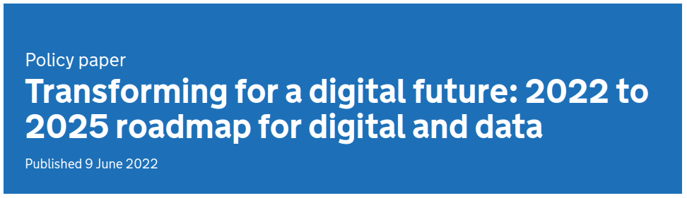

```{r, echo=FALSE}
library(metathis)
meta() %>% 
  meta_description(params$event) %>% 
  meta_name("github-repo" = paste0("datactivist/", params$slug)) %>% 
  meta_viewport() %>% 
  meta_social(
    title = params$title,
    url = paste0("https://datactivist.coop/", params$slug),
    image = params$image,
    image_alt = params$image_alt,
    og_type = "website",
    og_author = "Datactivist",
    og_locale = "fr_FR",
    og_site_name = "Datactivist",
    twitter_card_type = "summary",
    twitter_creator = "@datactivi_st")

```

layout: true

<style>
.remark-slide-number {
  position: inherit;
}

.remark-slide-number .progress-bar-container {
  position: absolute;
  bottom: 0;
  height: 4px;
  display: block;
  left: 0;
  right: 0;
}

.remark-slide-number .progress-bar {
  height: 100%;
  background-color: #e95459;
}

</style>


`r paste0("<div class='my-footer'><span>", params$event, "</span> <center><div class=logo><a href='https://datactivist.coop/'></a></div></center></span></div>")` 


---

class: center, middle

This presentation is available at : `r paste0("http://datactivist.coop/", params$slug, "/presentations/", params$session, "/", params$module)`

Sources : `r paste0("https://github.com/datactivist/", params$slug, "/presentations/", params$session, "/", params$module)`


All Datactivist productions are freely usable under the terms of [Creative Commons 4.0 BY-SA](https://creativecommons.org/licenses/by-sa/4.0/legalcode.fr) licence.

<BR>
<BR>


---

background-image: url(https://media.giphy.com/media/7AJdZ5SgaRQC4/giphy.gif)
class: inverse, center, top


# This presentation is under construction

.footnote[Please come back on August, 22nd<br>for release.]

---

# Disclaimer : our moto

> There are no silly questions.

--

> There's only awkward silences.


---

### The objectives

* understanding what's Python ;
* understanding what's a notebook and learning how to use it ;
* understanding what's data science ;
* learning how to perform basic data exploration ;
* learning how to answer questions with a dataset.

---

### The teachers

```{css, echo=F}
    /* Table width = 100% max-width */

    .remark-slide table{
        width: 100%;
    }

    /* Change the background color to white for shaded rows (even rows) */

    .remark-slide thead, .remark-slide tr:nth-child(2n) {
        background-color: #fff1eb;
    }
```

**Mathieu Morey** | **Sylvain Lapoix** | **Clément Mandron (TA)**
--------|---------|---------
.center[] | .center[] | .center[]
He is a researcher in computer science, specialized in data science and machine learning. He is also consultant at .red[Datactivist]. | Datajournalist and consultant at .red[Datactivist], he works with civil society and public actors on data literacy, data analysis & open data. | Graduated from the Urban School of SciencesPo, he is consultant at .red[Datactivist] and works with local and national governments.

---

### What is .red[Datactivist] ? 

### We .red[open data], we make them .red[useful]


- Datactivist is a French cooperative company un specialised in open data created in 2016 with a mission to .red[**open data and make them useful**].

- On all stages of the work of opening data, Datactivist works with .red[**both data producers and reusers**] and participates in the the appropriation of data by everyone.

- We practice what we preach and our dedication to the .red[**commons**] : we are a workers co-operative and our productions are freely usable by anyone.

- We believe .red[**research**] can help us better understand and solve the issue we face in the open data field

---
class: middle

### Why .red[Datactivist] talks to you about data science ? 

--


.pull-left[
**1. We are working with organizations you are likely to work for**

**2. Our methods: the digital transformation by the (open) data**
]

.pull-right[]

---

### Two (very) quick examples of what .red[Datactivist] do

--
.pull-left[
**Research and data mapping for the RATP** about all data sources available at regional level.

.center[]


]

--
.pull-right[

**Support for a data cataloguing mission** in order to implement good method to crawl data amoung information systems 

.center[]


]


---


background-image: url(https://media.giphy.com/media/d1E1kn94NNfrlPGw/source.gif)
class: inverse, center, top


# What is this class ?

---

### .red[For what purposes] will you practice data science in a public affairs class ?


* **#1** Digital transformation of organization is now based on (open) data

* **#2** Data are raw material to design and implement data-driven policies

* **#3** There is a very engaging legal and political framework

---

### #1 - Digital transformation of organization is now based on .red[(open) data]


.left-column[**Step 1 : From information systems services to digital services**]

.right-column[.center[]]


---

### #1 - Digital transformation of organization is now based on .red[(open) data]

.left-column[**Step 2 : From digital services to digital AND data services**]

.right-column[
[Source](https://www.publictechnology.net/articles/news/scores-gds-staff-moved-new-central-digital-and-data-office)
]
---

### #2 - Data are raw material to design and implement .red[data-driven policies]

**Data-Information-Knowledge-Wisdom pyramid**

.pull-left[
[](https://commons.wikimedia.org/w/index.php?curid=37705247)
]

.pull-right[Attributed to [Russell Ackoff](http://en.wikipedia.org/wiki/Russell_L._Ackoff), 1989

Data may be :

- Facts
- signals
- symbols]

---

### #2 - Data are raw material to design and implement .red[data-driven policies]

.pull-left[

]
.pull-right[
> *Data are commonly understood to be the raw material produced by **abstracting the world** into categories, measures and other representational forms – numbers, characters, symbols, images,sounds, electromagnetic waves, bits – that constitute the **building blocks** from which information and knowledge are created.*]

---

### #2 - Data are raw material to design and implement .red[data-driven policies]

.center[**Use case of data-driven public policy, any ideas ?**]

.center[]

---

### #2 - Data are raw material to design and implement .red[data-driven policies]

.pull-left[
**Some fileds and ideas :**

- Public spending control
- Carbon budgets
- Health and human services
- Fraud detection
- Tax evasion
- ...


]
.pull-right[

**Data analysis and data science are everywhere :**

- OECD reports
- Public policy assessment
- Covid dashboards
- Census data
- ...


]

.center[And many others !]

---

### #2 - Data are raw material to design and implement .red[data-driven policies]

.center[]

.center[https://climatechange.europeandatajournalism.eu/en/map]

---

### #3 There is a very engaging .red[legal and political framework]

***Things are moving now !***

Two new acts part of the .red[European Data Strategy (2020)] : 

- The Data Governance Act (applicable from **September 2023**)
- The Data Act (adopted by Commission on **February 2022**)

.center[]
.center[https://digital-strategy.ec.europa.eu/en/policies/strategy-data]

---

### #3 There is a very engaging .red[legal and political framework]

.left[]
.center[]
.right[]


---

### And now ? 

</BR>
<BR>

.center[]

---
class: middle

.pull-left[
**The Github repo will be your house for this bootcamp**. Link : https://github.com/datactivist/scpo-data-science-bootcamp

1- Follow the link of the Google Colab notebook


2- Save a copy of the notebook in your own Google Drive storage


]

.pull-right[

**Breaks and back to plenary :**

- 11:25 - break - 15 minutes (please come back at 11:40 !)
- 12:40 - group correction - 20 minutes

- 1:00 - **lunch break** - 60 minutes (please come back at 2:00 !)

- 3:25 - break 2 - 15 minutes (please come back at 3:40 !)
- 4:35 - break 3 - 15 minutes (please come back at 4:50 !)

- 5:20 - group correction and quizz day 1

]

---
class: middle

.pull-left[
**The Github repo will be your house for this bootcamp**. Link : https://github.com/datactivist/scpo-data-science-bootcamp

1- Follow the link of the Google Colab notebook


2- Save a copy of the notebook in your own Google Drive storage


]

.pull-right[


]


---

class: inverse, center, middle

# Questions ?

Contact : [mathieu@datactivist.coop](mailto:mathieu@datactivist.coop), [sylvain@datactivist.coop](mailto:sylvain@datactivist.coop) & [clement@datactivist.coop](mailto:clement@datactivist.coop)