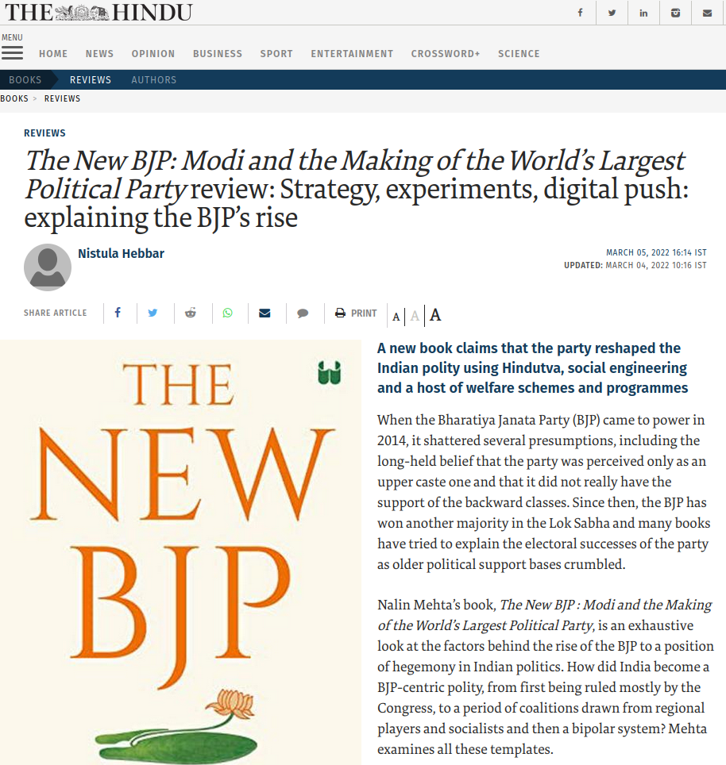
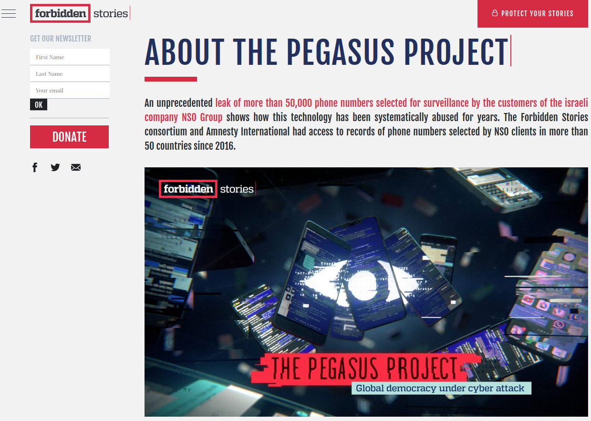
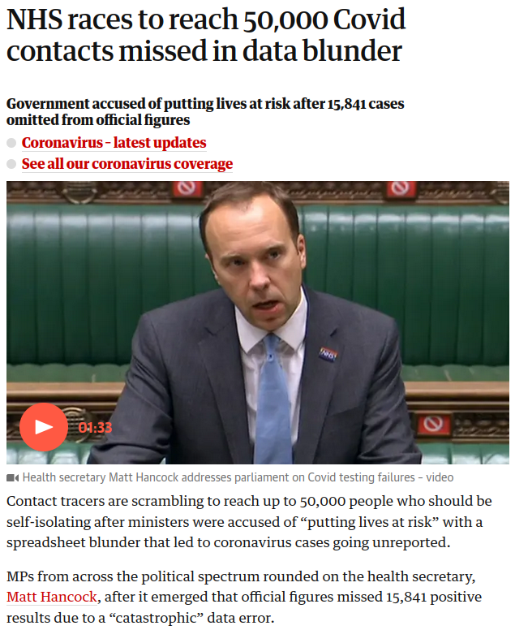
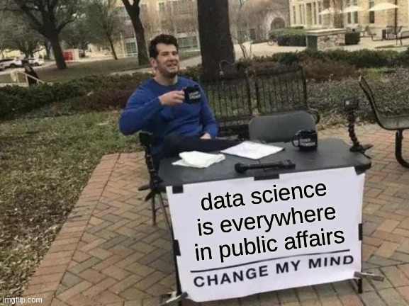

```{r, echo=FALSE}
library(metathis)
meta() %>% 
  meta_description(params$event) %>% 
  meta_name("github-repo" = paste0("datactivist/", params$slug)) %>% 
  meta_viewport() %>% 
  meta_social(
    title = params$title,
    url = paste0("https://datactivist.coop/", params$slug),
    image = params$image,
    image_alt = params$image_alt,
    og_type = "website",
    og_author = "Datactivist",
    og_locale = "fr_FR",
    og_site_name = "Datactivist",
    twitter_card_type = "summary",
    twitter_creator = "@datactivi_st")

```

layout: true

<style>
.remark-slide-number {
  position: inherit;
}

.remark-slide-number .progress-bar-container {
  position: absolute;
  bottom: 0;
  height: 4px;
  display: block;
  left: 0;
  right: 0;
}

.remark-slide-number .progress-bar {
  height: 100%;
  background-color: #e95459;
}


.yellow-h{
   background: #ffff88;
}

.blue-h{
   background: #83c7fc;
}

.white-bg{
   background: #ffffff;
}


.caption {
  text-align: right;
  font-size: .8rem;
}

.redred {
  color: #ff0000;
}

.green {
  color: #00ff00;
}

.orange {
  color: #ffa500;

}

.quote {
  font-family: 'Rokkitt';
  font-weight: bold;
  font-style: italic;
  font-size: 28px;
}


.pull-left-wide {
  width: 65%;
  float: left;
}

.pull-right-wide {
  width: 65%;
  float: right;
}

.pull-right-narrow {
  width: 30%;
  float: right;
}

.pull-left-narrow {
  width: 30%;
  float: left;
}

</style>


`r paste0("<div class='my-footer'><span>", params$event, "</span> <center><div class=logo><a href='https://datactivist.coop/'></a></div></center></span></div>")` 


---

class: center, middle

This presentation is available at : `r paste0("http://datactivist.coop/", params$slug, "/presentations/", params$session, "/", params$module)`

Sources : `r paste0("https://github.com/datactivist/", params$slug, "/presentations/", params$session, "/", params$module)`


All Datactivist productions are freely usable under the terms of [Creative Commons 4.0 BY-SA](https://creativecommons.org/licenses/by-sa/4.0/legalcode.fr) licence.

<BR>
<BR>


---


class: center, top

## After this bootcamp, you may want to escape data science

.center[

]

## for good ...


---

background-image: url(https://media.giphy.com/media/13ROLRgvNf5WQo/giphy.gif?cid=ecf05e4784jizw5cdsfi7b38uapop892fbhcsza9sh3y3iq6&rid=giphy.gif&ct=g)
class: center, top


## ... unfortunately for you, it will be hard to avoid it

---


background-image: url(https://media.giphy.com/media/xT9C25UNTwfZuk85WP/giphy-downsized-large.gif?cid=ecf05e471uzc5tuw52n0dslae0e6hksd2e0cqmqzm7jjcker&rid=giphy-downsized-large.gif&ct=g)
class: center, top

## Whatever path you choose,<br>you'll find data on your way

---

## as a policy maker

.pull-left-wide[

]

.pull-right-narrow[
Sample from the [AR5 synthesis report on climate change 2014's](https://www.ipcc.ch/report/ar5/syr/) Summary for policy makers of the IPCC.
]

---

## as a political representative

.pull-left-wide[

]

.pull-right-narrow[
Example : [The New BJP: Modi and the Making of the World’s Largest Political Party review: Strategy, experiments, digital push: explaining the BJP’s rise](https://www.thehindu.com/books/books-reviews/the-new-bjp-modi-and-the-making-of-the-worlds-largest-political-party-review-strategy-experiments-digital-push-explaining-the-bjps-rise/article65092321.ece), The Hindu (2022)
]

---

## as a public policy researcher

Ex. : [Restrictions on data-driven political micro-targeting in Germany, Kruschinski, Simon; Haller, André (2021)](https://policyreview.info/articles/analysis/restrictions-data-driven-political-micro-targeting-germany).

.center[

]

---

## as a journalist

.pull-left[
**Sometimes data science makes the news**

Ex. : [The Pegasus project](https://forbiddenstories.org/about-the-pegasus-project/).




]


.pull-right[
**Sometimes data science is the news**

Ex. : [NHS races to reach 50,000 Covid contacts missed in data blunder](https://www.theguardian.com/politics/2020/oct/05/ministers-accused-of-putting-lives-at-risk-with-covid-data-error), The Guardian (2021)




]

---

## as a civil servant

Example : fight against tax evasion in France ([BFM, 2022)](https://www.bfmtv.com/economie/patrimoine/impots-fiscalite/impots-comment-le-fisc-recourt-a-l-intelligence-artificielle-pour-lutter-contre-la-fraude_AN-202206220028.html).


---

## as a citizen

Let's face it : you're socially made of data.

.center[

]

---

class: inverse, center, middle

## What do you think about it ?

.center[

]

---


class: inverse, center, middle

# Questions ?

Contact : [mathieu@datactivist.coop](mailto:mathieu@datactivist.coop), [sylvain@datactivist.coop](mailto:sylvain@datactivist.coop) & [clement@datactivist.coop](mailto:clement@datactivist.coop)