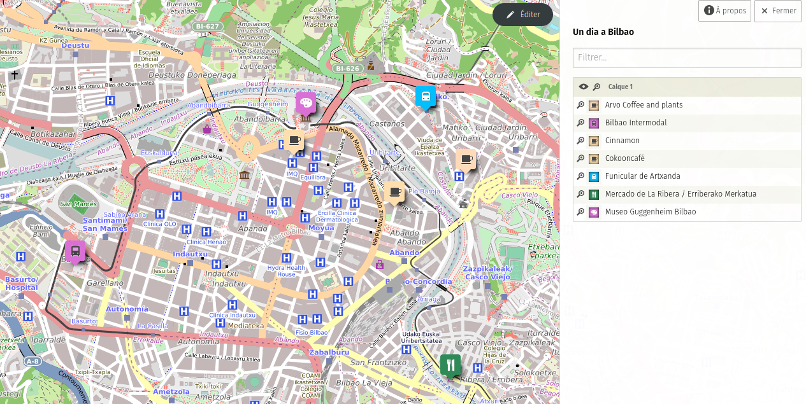
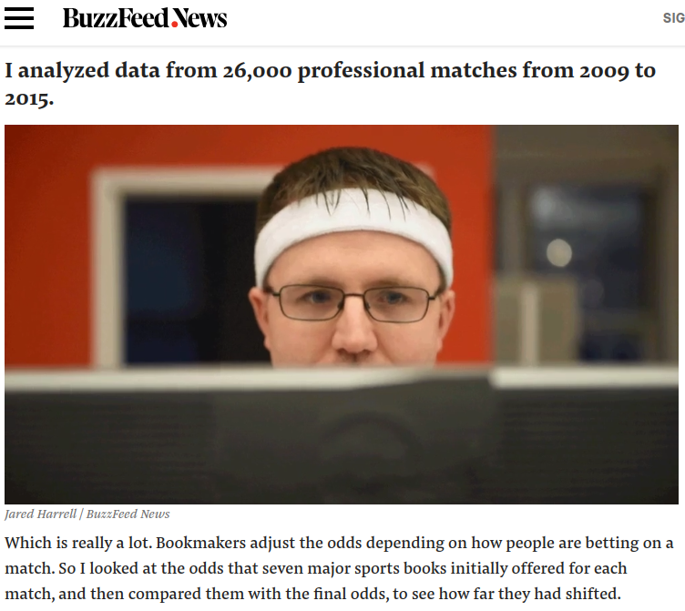
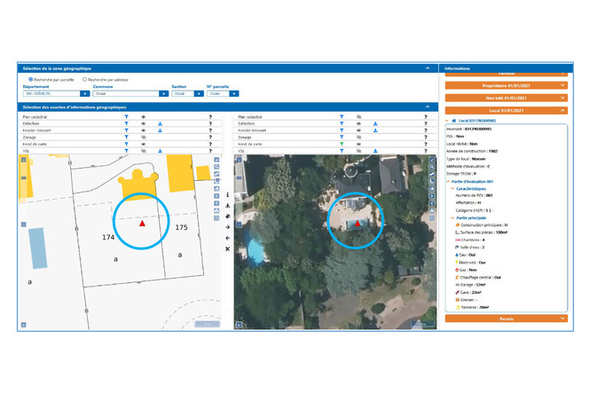
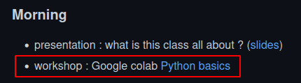
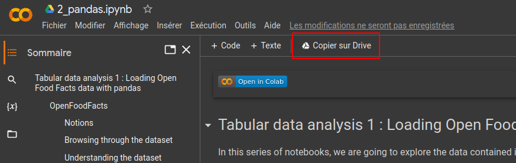

layout: true

`r paste0("
", params$event, "
")` 

---

class: center, middle

This presentation is available at : `r paste0("https://moreymat.github.io/", params$slug, "/presentations/", params$session, "/", params$module)`

Sources : `r paste0("https://github.com/moreymat/", params$slug, "/presentations/", params$session, "/", params$module)`

Those productions are freely usable under the terms of [Creative Commons 4.0 BY-SA](https://creativecommons.org/licenses/by-sa/4.0/legalcode.fr) licence.

 
 

---

# Disclaimer : our moto

> There are no silly questions.

--

> There are only awkward silences.

---

## The objectives

* understanding what Python is ;
* understanding what a notebook is and learning how to use it ;
* understanding what data science is ;
* learning how to perform basic data exploration ;
* learning how to answer questions with a dataset.

---

## The teachers

.pull-left[
.center[**Mathieu Morey**]

.center[]

Researcher and consultant.

Based in Marseille ⚽

Works with public actors on data science, machine learning and natural language processing.

]

.pull-right[
.center[**Sylvain Lapoix**]

.center[]

Datajournalist and trainer.

Based in La Rochelle 🏉

Works for digital and print media on ecological, technological and social topics.

]

---

background-image: url(https://media.giphy.com/media/v1.Y2lkPTc5MGI3NjExczVkYjgwa2g0NmpieGlkZDBwbm0ybXE5M3hqaThlejVidGFxeHd3ayZlcD12MV9pbnRlcm5hbF9naWZfYnlfaWQmY3Q9Zw/3orif2koCdb7r26hAQ/giphy.gif)

class: inverse, center, top

### But, why us ?

---

background-image: url(https://media.giphy.com/media/v1.Y2lkPTc5MGI3NjExbmc2aHM4ZzlxOXgxZjB4Zmp2aGE0d3N3YXZibGU5cXpjNXQ1NWRkdiZlcD12MV9pbnRlcm5hbF9naWZfYnlfaWQmY3Q9Zw/8IGuMMq3Aka8Zq9Kax/giphy.gif)

class: inverse, center, top

### For 1 : we know how to do computer stuff

---

background-image: url(https://media.giphy.com/media/MC6eSuC3yypCU/giphy.gif)

class: inverse, center, top

### For 2 : we tend to see things in a certain way

---

## A .red[*"data state of mind"*]

.quote["you should be looking for data stored in computers. Usually that’s going to be data that you analyse in order to quantify or measure something or otherwise prove your point. [...] you’re not relying solely -- or even primarily -- on people to tell you what’s going on. Documents and data tend to have a better memory and be more honest."]

.right[
[MaryJo Webster in her 2016 datajournalism.com piece](https://datajournalism.com/read/longreads/what-is-a-data-state-of-mind-and-how-you-can-develop-it) (herself referring to the *"documents state of mind"* coined by Donald Bartlett and James Steele).
]

---

background-image: url(https://media.giphy.com/media/v1.Y2lkPTc5MGI3NjExZ2YwMmk1MW84aGh1MGYzYTJ3anV3NDhhMXh6ZGZmaHJuM3dmYmNncyZlcD12MV9pbnRlcm5hbF9naWZfYnlfaWQmY3Q9Zw/YABz3fRfUFuec/giphy.gif)

class: inverse, center, top

## Case study : going on holidays with data-oriented people

---

### Case #0 : the Bilbao situation

**Real world situation** : Sylvain was on a day-trip to Bilbao (Northern Spain / Southern Basque country) with family. His mum wanted to go to the Gunggenheim. His sister had to take a bus at the bus station at 3. Sylvain noted local coffee roaster he'd like to try. They all wanted to *"walk around"*.

.pull-left-narrow[

**Question** : which path should they choose to fulfill everyone's demand without compromising Sylvain's sister return to France ?

]

--

.pull-right-wide[
**Data state of mind approach** : Let's build a map based on the coordinates of the spots to see if a pattern emerges !

]

---

### Methods

The data state of mind grows on some practices and methods that developp a culture of data which enables it for day-to-day use.

Those methods include :

* **the "dream data base"** : imagine the data that would perfectly meet your need to assess a fact and try to close in on the closest existing data source ;

* **the funnel search** : start from the general data including the cases you're looking for and narrow down until you can't find anything more specific ;

* **the closest neighbour search** : dig into a database you already know and which is related to your topic of interest to find clues that lead you to data directly describing what you're looking for.

Extra skills :

* advanced Google search operators ;
* census and data collection regulations knowledge ;
* public statistics, etc.

---

background-image: url(https://media.giphy.com/media/daUf1VgWgm5JNAIHwI/giphy.gif)

class: inverse, center, top

## Case studies : data state of mind resolution of real world questions

---

### Case #1 : match-fixing in tennis

**Real world situation** : World tennis authorities have been handled evidence of match fixing by top players in international tournaments following a worldwide investigation. But none of the players identified as suspicious of rigging the results were sanctionned or banned from playing in competition.

.pull-left-narrow[

**Question** : how can you identify the players and matches that can be under some pressure or manipulation in favor of gambling organisations ?

]

--

.pull-right-wide[
**Data state of mind approach** : [Let's analyze tons of matches](https://www.buzzfeednews.com/article/heidiblake/the-tennis-racket) and find out the ones that play against the odds but in line with unusually big bets.

]

---

### Case #2 : swimming pool spotting

**Real world situation** : French tax legislator mandates home owner to report construction of some specific extensions of their property : garage, swimming pools and veranda. Swimming pools are taxed based on their surface.

.pull-left-narrow[

**Question** : how can we spot the undeclared swimming pools to confront home owners and claim those unpaid taxes ?

]

--

.pull-right-wide[
**Data state of mind approach** : Let's train an AI to spot the shape and color of swimming pools on satellite images (credit : [Generation NT](https://www.generation-nt.com/actualites/fisc-piscine-detection-ia-generalisation-ign-capgemini-google-dgfip-2004459)).

[A controversial choice](https://www.nextinpact.com/article/48352/dans-coulisses-foncier-innovant-detecteur-piscines-fisc) ...

]

---

### Case #3

**Real world situation** : 

.pull-left-narrow[

**Question** : 

]

--

.pull-right-wide[
**Data state of mind approach** : 

]

---

background-image: url(https://media.giphy.com/media/v1.Y2lkPTc5MGI3NjExYTJ3YjBteHB5aWdxZ253aWluNXNoaW1keTFlbXRoNjJsbG9nYnBqMCZlcD12MV9pbnRlcm5hbF9naWZfYnlfaWQmY3Q9Zw/9JJtjLliEF5N68yf3e/giphy.gif)

class: inverse, center, top

## What about you : do you have any real world problem you'd like to be able to tackle with data ?

---

### And now ? 

 
 

.center[

]

---

.pull-left[

**Breaks and back to plenary :**

- 11:25 - break - 15 min (please come back at 11:40 !)
- 12:40 - group correction - 20 min

- 1:00 - **lunch break** - 60 min (please come back at 2:00 !)
- after lunch break - 20 min presentation by Sylvain

- 3:25 - break 2 - 15 min (please come back at 3:40 !)
- 4:35 - break 3 - 15 min (please come back at 4:50 !)
- 5:20 - group correction and quiz day 1

]

--

.pull-right[
**The Github repo will be your house for this bootcamp**. Link : https://github.com/moreymat/scpo-data-science-bootcamp

1- Follow the link of the Google Colab notebook

2- Save a copy of the notebook in your own Google Drive storage

]

---

class: inverse, center, middle

# Questions ?

Contact : [mathieu.morey@gmail.com](mailto:mathieu.morey@gmail.com) & [sylvainlapoix@protonmail.com](mailto:sylvainlapoix@protonmail.com)