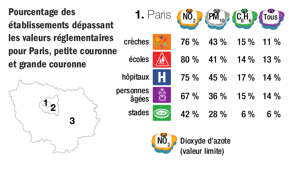

layout: true

`r paste0("
", params$event, "
")` 

---

class: center, middle

This presentation is available at : `r paste0("https://moreymat.github.io/", params$slug, "/presentations/", params$session)`

Sources : `r paste0("https://github.com/moreymat/", params$slug, "/presentations/", params$session)`

Those productions are freely usable under the terms of [Creative Commons 4.0 BY-SA](https://creativecommons.org/licenses/by-sa/4.0/legalcode.fr) licence.

 
 

---

## Today's program

- 10:00 - presentation ;
- 10:30 - back to work ;
- 11:15 - break 1 (15' tops)
- 13:00 - **lunch break** - 60 min
- 14:00 - presentation
- 15:25 - break 2 (15' tops)
- 16:35 - break 3 (15' tops)
- 17:20 - group correction and quiz day 2

---

background-image: url(https://i.giphy.com/media/v1.Y2lkPTc5MGI3NjExa2xsb3N1eG8wdDVhZG41bzB0MzZmNDU0bWlya2Q0bXg3emJxZGhidSZlcD12MV9pbnRlcm5hbF9naWZfYnlfaWQmY3Q9Zw/l4RKhOL0xiBdbgglFi/giphy.gif)
class: inverse, center, top

# Coding in the real : data is here, but ...

---

background-image: url(https://i.giphy.com/media/v1.Y2lkPTc5MGI3NjExY3B1NDZ6aDlhcTJiYmpvcWhhZXRhbzRoOHBwZWVjMmRrZm1wMW5wcyZlcD12MV9pbnRlcm5hbF9naWZfYnlfaWQmY3Q9Zw/oAbvMXvah1M0U/giphy.gif)
class: inverse, center, top

## Air quality connundrum

---

### What is a pollutant ?

.pull-left[
Some must remain in restricted amount in the air :

* NO2 ;
* PM ;
* O3 ;
* etc.

Source : [Airparif](https://www.airparif.fr/surveiller-la-pollution/les-polluants-surveilles).
]

.pull-right[

]

---

### Certified producers

---

### Policies are connected to this

.center[

]

---

### A publication raised awarness ...

.pull-left[

]

--

.pull-right[
This raised awarness, especially :

]

---

### Data is available (kind of)

[Airparif air quality map](https://www.airparif.fr/surveiller-la-pollution/bilans-et-cartes-annuels-de-pollution).

---

## We were commissionned ...

.center[

]

---

### First : get the location of relevant places

... with open data

.center[

]

---

### Then, we looked for the official air quality data

Source : [Airparif, Open data on ArcGIS](https://data-airparif-asso.opendata.arcgis.com/maps/6e69948502254bfcb6497f66b8cf1a43/explore)

--

What can you do about it ?

---

### Then, we asked politely ... more or less

.center[

]

---

### Then, we mapped it

.pull-left[

]

.pull-right[

]

---

background-image: url(https://i.giphy.com/media/v1.Y2lkPTc5MGI3NjExZ2QzbHNwY2pzbWtvYmhxaGNtcXV1MWxsM2EweTZyYXFlYnlkdXEzdyZlcD12MV9pbnRlcm5hbF9naWZfYnlfaWQmY3Q9Zw/xT5LMDXc3ZhBFESPAc/giphy.gif)
class: inverse, center, top

## Outcomes

---

### Political reactions

.center[

]

---

### Citizen awarness

.pull-left[
Source : [Respire](https://respire-asso.org/en-2024-encore-10-ecoles-mobilisees-contre-la-pollution-de-lair-a-bagnolet-93-montreuil-93-colombes-92-et-paris-75/)

]

.pull-right[

]

---

background-image: url(https://i.giphy.com/media/v1.Y2lkPTc5MGI3NjExYnRwbHdhcDFlbTJtNGM1a3UxeTQzNDh2MWoydm56dG01ZWlrNW1scCZlcD12MV9pbnRlcm5hbF9naWZfYnlfaWQmY3Q9Zw/Kx7HO28xRu1cG8S3GB/giphy.gif)
class: inverse, center, top

## Limits

---

background-image: url(https://i.giphy.com/media/v1.Y2lkPTc5MGI3NjExMjZ2azdmdzJ6eTBkcjMzdnpmdGh2amZiNXBrZjZ2MDI4ZWNwdXBoZyZlcD12MV9pbnRlcm5hbF9naWZfYnlfaWQmY3Q9Zw/bGgsc5mWoryfgKBx1u/giphy.gif)
class: inverse, center, top

# Back to your notebooks !

---

background-image: url(https://i.giphy.com/media/v1.Y2lkPTc5MGI3NjExNGJub2EzMW55MDhkNmYwY2k2OXNiOGI0dG5jd2sxMWxreTRlZ2Z5MyZlcD12MV9pbnRlcm5hbF9naWZfYnlfaWQmY3Q9Zw/uurtMtTKqkJda4dk8Y/giphy-downsized-large.gif)
class: inverse, center, top

# Coding time !

---

class: inverse, center, middle

# Questions ?

Contact : [mathieu.morey@gmail.com](mailto:mathieu.morey@gmail.com) & [sylvainlapoix@protonmail.com](mailto:sylvainlapoix@protonmail.com)